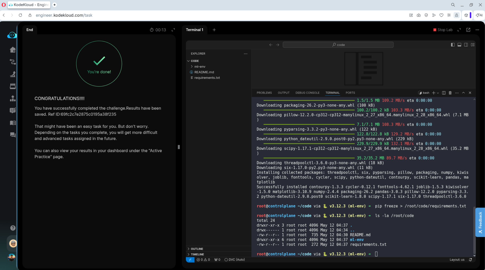

# Day 001 — Create a Python Virtual Environment for ML

---

## Problem

The data science team required a standardized, reproducible Python runtime on a shared control plane host. Specific ML dependencies (`numpy`, `pandas`, `scikit-learn`, `matplotlib`) had to be installed without contaminating system-level Python libraries.

---

## Solution

- Created an isolated virtual environment at `/root/code/ml-env`
- Upgraded `pip` before installing packages
- Generated a `requirements.txt` manifest for deterministic rebuilds
- Fixed a typo in the filename (`requirments.txt` → `requirements.txt`) that would have silently broken downstream CI/CD runners

---

## Commands

```bash
mkdir -p /root/code && cd /root/code
python3 -m venv ml-env
source ml-env/bin/activate
pip install --upgrade pip
pip install numpy pandas scikit-learn matplotlib
pip freeze > /root/code/requirements.txt
```

---

## Screenshot



---

## Notes

The `pip freeze` output pins exact versions — important for reproducibility across nodes. Treat `requirements.txt` as infrastructure state, not an afterthought.
