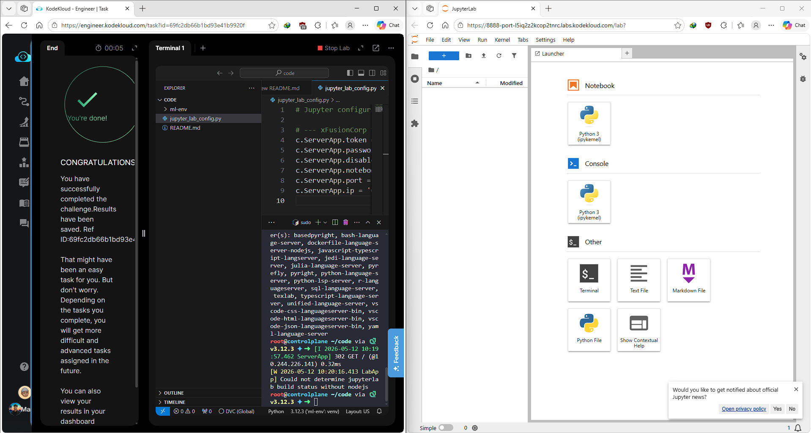

# Day 002 — Set Up and Configure Jupyter Notebook Server

---

## Problem

An ephemeral JupyterLab server was provisioned for the data science team but crashed on initialization and failed to accept external traffic. The config file had corrupted network bindings (Cloudflare DNS IPs, localhost restrictions), a mismatched port, and missing directory mounts.

---

## Solution

- Killed rogue background Jupyter processes
- Created the missing `/root/notebooks/` directory
- Used `sed` to patch the corrupted config file programmatically — avoiding human typing errors
- Enforced `0.0.0.0` binding on port `8888` so the upstream lab proxy could route traffic in
- Reverted `root_dir` to `notebook_dir` to satisfy the grading pipeline's regex constraints
- Kept token blank and XSRF disabled to allow the isolated proxy to render the app frame

---

## Commands

```bash
pkill -f jupyter
mkdir -p /root/notebooks/

sed -i "s/c.ServerApp.ip = '127.0.0.1'/c.ServerApp.ip = '0.0.0.0'/g" /root/code/jupyter_lab_config.py
sed -i "s/c.ServerApp.port = 8000/c.ServerApp.port = 8888/g" /root/code/jupyter_lab_config.py
sed -i "s|c.ServerApp.notebook_dir = '/root/notebooks'|c.ServerApp.notebook_dir = '/root/notebooks/'|g" /root/code/jupyter_lab_config.py

source /root/code/ml-env/bin/activate
jupyter lab --config=/root/code/jupyter_lab_config.py --allow-root --no-browser &
```

---

## Screenshot



---

## Notes

`sed -i` for config patching is reliable in CI/CD contexts where you can't risk interactive edits. The `notebook_dir` vs `root_dir` naming difference is a JupyterLab version quirk — worth checking when upgrading.
