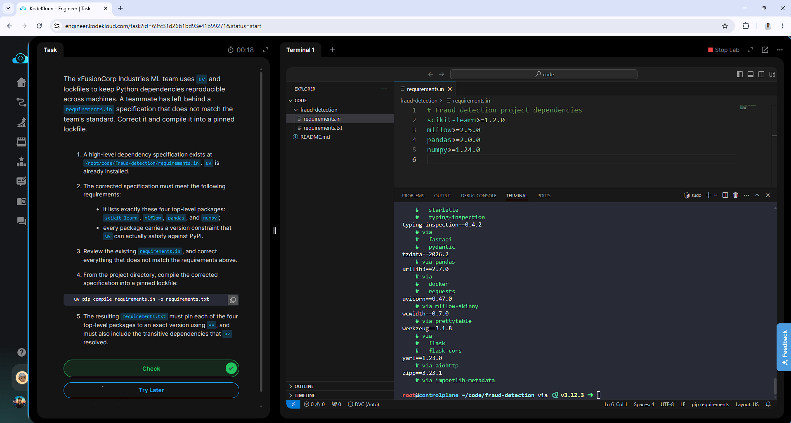

# Day 003 — Fix a Broken uv Lockfile Specification

**Date:** 2026-05-14

---

## Problem

The ML team uses `uv` and lockfiles to keep Python dependencies reproducible across machines. A teammate left behind a `requirements.in` at `/root/code/fraud-detection/` that did not match the team's standard — invalid package names (e.g. `sklearn` instead of `scikit-learn`) and version constraints `uv` could not satisfy against PyPI.

Requirements:
- List exactly four packages: `scikit-learn`, `mlflow`, `pandas`, `numpy`
- Every package must carry a version constraint `uv` can resolve
- Compile into a pinned `requirements.txt` where each top-level package is pinned with `==`

---

## Solution

- Reviewed the broken `requirements.in` — identified invalid package names and unusable version constraints
- Overwrote the file with correct PyPI package names and valid minimum version constraints
- Compiled the corrected spec into a pinned lockfile using `uv pip compile`
- Verified the output contained exact `==` pins for all four packages plus resolved transitive dependencies

---

## Commands

```bash
# Navigate to the project directory
cd /root/code/fraud-detection/

# Overwrite broken requirements.in with valid constraints
cat <<EOF > requirements.in
scikit-learn>=1.2.0
mlflow>=2.5.0
pandas>=2.0.0
numpy>=1.24.0
EOF

# Compile exact transitive dependency tree into a pinned lockfile
uv pip compile requirements.in -o requirements.txt

# Verify lockfile contains exact pins (==)
head -n 10 requirements.txt
```

---

## Screenshot



---

## Notes

`sklearn` is the import name, not the PyPI package name — the installable package is `scikit-learn`. This is a common mistake that silently fails. `uv pip compile` is deterministic: same inputs always produce the same lockfile, making it a drop-in replacement for `pip-tools` with significantly faster resolution.
