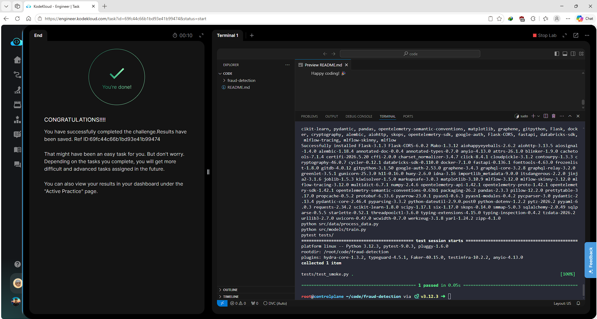

# Day 005 — Create a Makefile for ML Workflow Automation


---

## Problem

A draft `Makefile` at `/root/code/fraud-detection/Makefile` was broken — `make all` failed. The team uses Make to orchestrate six standard targets: `setup`, `data`, `train`, `test`, `clean`, and `all`. The existing file had incorrect indentation (spaces instead of tabs) and missing or misconfigured targets.

Requirements:
- All six targets declared as `.PHONY`
- `setup` — creates `mlops-venv/` and installs from `requirements.txt`
- `data` — runs `python src/data/process_data.py`
- `train` — runs `python src/models/train.py`
- `test` — runs `pytest tests/`
- `clean` — removes all `__pycache__`, `.pytest_cache`, and `models/` contents
- `all` — runs `setup → data → train → test` in order
- Recipes must use real tab characters (Make rejects spaces)

---

## Solution

- Reconstructed the entire Makefile using `printf` to guarantee literal tab characters in recipes
- Declared all six targets as `.PHONY`
- Chained `all` to run the four targets in the correct order
- Validated with `make all`

---

## Commands

```bash
cd /root/code/fraud-detection/

printf ".PHONY: setup data train test clean all\n\n" > Makefile
printf "all: setup data train test\n\n" >> Makefile
printf "setup:\n\tpython3 -m venv mlops-venv\n\t. mlops-venv/bin/activate && pip install -r requirements.txt\n\n" >> Makefile
printf "data:\n\tpython src/data/process_data.py\n\n" >> Makefile
printf "train:\n\tpython src/models/train.py\n\n" >> Makefile
printf "test:\n\tpytest tests/\n\n" >> Makefile
printf "clean:\n\tfind . -type d -name \"__pycache__\" -exec rm -rf {} +\n\trm -rf .pytest_cache\n\trm -rf models/*\n" >> Makefile

make all
```

---

## Screenshot



---

## Notes

Make silently rejects tab-less recipes — the error message ("missing separator") is confusing if you don't know the root cause. Using `printf` with `\t` is the safest way to write Makefiles programmatically. `.PHONY` prevents Make from skipping a target if a file with the same name exists in the directory.
