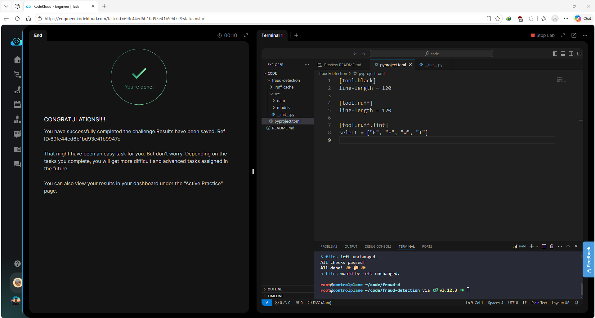

# Day 006 — Set Up Code Quality Tools for ML Code


--

## Problem

The `fraud-detection` project failed both `ruff check src/` and `black --check src/`. The `pyproject.toml` had incorrect or missing configuration — wrong `ruff` schema (pre-0.1 style), mismatched line lengths, and source files that violated formatting and lint rules.

Requirements:
- `ruff` and `black` both configured with line length of 120
- `ruff` lint rules `E`, `F`, `W`, `I` declared under `[tool.ruff.lint]` (ruff 0.1+ schema)
- `ruff check src/` exits with status 0
- `black --check src/` exits with status 0

---

## Solution

- Corrected `pyproject.toml`: moved lint rule selection to `[tool.ruff.lint]`, aligned line length to 120 for both tools
- Auto-fixed lint violations with `ruff check --fix src/`
- Auto-formatted source files with `black src/`
- Verified both tools exit clean

---

## Commands

```bash
cd /root/code/fraud-detection/

# Fix pyproject.toml — correct ruff schema and line length
cat <<EOF > pyproject.toml
[tool.ruff]
line-length = 120

[tool.ruff.lint]
select = ["E", "F", "W", "I"]

[tool.black]
line-length = 120
EOF

# Auto-fix ruff violations
ruff check --fix src/

# Auto-format with black
black src/

# Validate both pass
ruff check src/
black --check src/
```

---

## Screenshot



---

## Notes

`ruff` 0.1+ moved lint rule selection from `[tool.ruff]` to `[tool.ruff.lint]` — the old location is silently ignored in newer versions, which causes unexpected failures. Always verify the schema version matches the installed `ruff` binary. `black` and `ruff` line lengths must match, otherwise `black` reformats code that `ruff` then flags, creating a loop.
