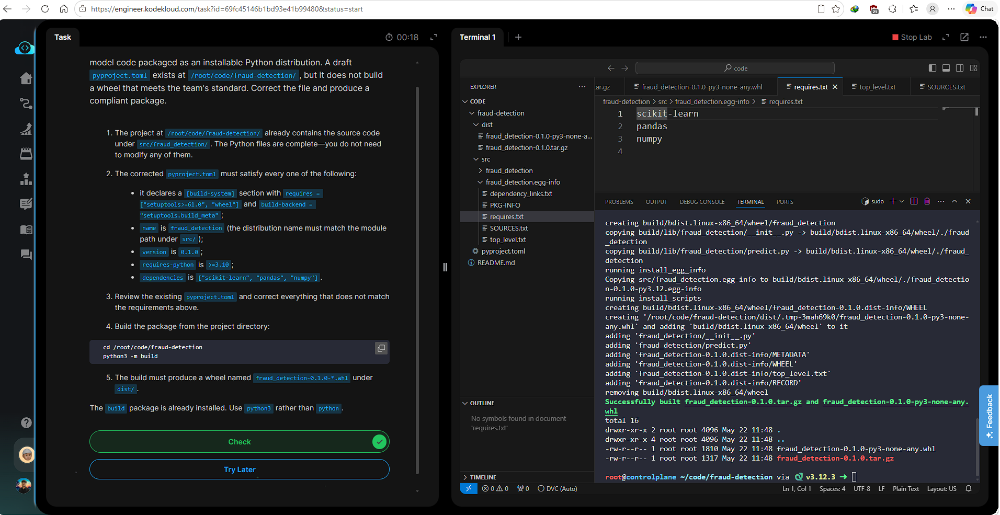

# Day 007 — Package an ML Project as Installable Python Package

---

## Problem

The `fraud-detection` model code needed to be packaged as an installable Python distribution. The existing `pyproject.toml` did not meet the team's standard — wrong distribution name, missing `[build-system]` section, incorrect metadata. The build produced no compliant wheel.

Requirements:
- `[build-system]`: `requires = ["setuptools>=61.0", "wheel"]`, `build-backend = "setuptools.build_meta"`
- `name = "fraud_detection"` (must match the module path under `src/`)
- `version = "0.1.0"`
- `requires-python = ">=3.10"`
- `dependencies = ["scikit-learn", "pandas", "numpy"]`
- Build must produce `fraud_detection-0.1.0-*.whl` under `dist/`

---

## Solution

- Overwrote `pyproject.toml` with the correct schema — removed legacy/conflicting metadata
- Built the package with `python3 -m build`
- Verified `dist/` contained the correct `.whl` artifact

---

## Commands

```bash
cd /root/code/fraud-detection/

cat << 'EOF' > pyproject.toml
[build-system]
requires = ["setuptools>=61.0", "wheel"]
build-backend = "setuptools.build_meta"

[project]
name = "fraud_detection"
version = "0.1.0"
requires-python = ">=3.10"
dependencies = [
    "scikit-learn",
    "pandas",
    "numpy"
]
EOF

python3 -m build

ls -la dist/
```

---

## Screenshot



---

## Notes

The distribution `name` in `pyproject.toml` must match the directory name under `src/` — using `fraud-detection` (with a hyphen) instead of `fraud_detection` (underscore) causes the build to fail or produce an unimportable package. `python3 -m build` generates both a `.tar.gz` source archive and a `.whl` built distribution; the wheel is what gets installed via `pip`.
