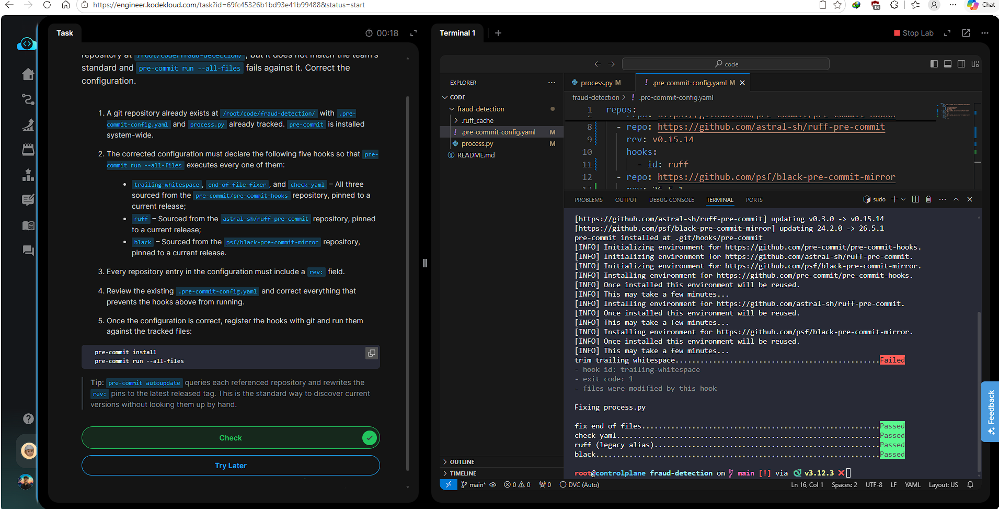

# Day 008 — Configure Pre-Commit Hooks for ML Repository

**Date:** 2026-05-19

---

## Problem

A broken `.pre-commit-config.yaml` at `/root/code/fraud-detection/` caused `pre-commit run --all-files` to fail. The configuration was missing `rev:` pins and did not include all five required hooks.

Requirements:
- `trailing-whitespace`, `end-of-file-fixer`, `check-yaml` from `pre-commit/pre-commit-hooks`
- `ruff` from `astral-sh/ruff-pre-commit`
- `black` from `psf/black-pre-commit-mirror`
- Every repo entry must have a `rev:` field pinned to a current release

---

## Solution

- Overwrote `.pre-commit-config.yaml` with all five hooks and base version pins
- Ran `pre-commit autoupdate` to dynamically resolve and pin the latest release tags
- Registered hooks with `pre-commit install`
- Validated with `pre-commit run --all-files`

---

## Commands

```bash
cd /root/code/fraud-detection/

cat << 'EOF' > .pre-commit-config.yaml
repos:
  - repo: https://github.com/pre-commit/pre-commit-hooks
    rev: v4.5.0
    hooks:
      - id: trailing-whitespace
      - id: end-of-file-fixer
      - id: check-yaml
  - repo: https://github.com/astral-sh/ruff-pre-commit
    rev: v0.3.0
    hooks:
      - id: ruff
  - repo: https://github.com/psf/black-pre-commit-mirror
    rev: 24.2.0
    hooks:
      - id: black
EOF

pre-commit autoupdate
pre-commit install
pre-commit run --all-files
```

---

## Screenshot



---

## Notes

`pre-commit autoupdate` is the standard way to discover current version tags without looking them up manually — it queries each upstream repo and rewrites the `rev:` pins in place. Always run it after writing a new config rather than hardcoding versions by hand.
