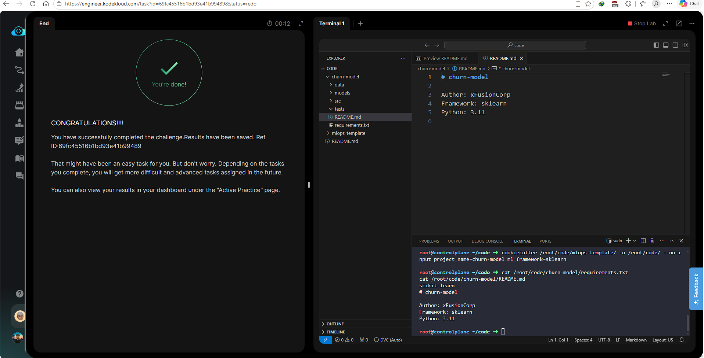

# Day 009 — Create a Custom ML Project Template with Cookiecutter

**Date:** 2026-05-20

---

## Problem

A broken Cookiecutter template at `/root/code/mlops-template/` failed to render. The `cookiecutter.json` was incomplete and the template directory had missing files, broken Jinja2 conditionals, and incorrect structure.

Requirements:
- `cookiecutter.json` with four variables: `project_name`, `author`, `python_version`, `ml_framework` (choices: sklearn, pytorch, tensorflow)
- `requirements.txt` renders the correct package based on `ml_framework`
- `README.md` references `project_name` and `author`
- Template directory contains: `README.md`, `requirements.txt`, `data/`, `models/`, `src/`, `tests/`
- Must generate `/root/code/churn-model/` with `scikit-learn` in `requirements.txt` and `xFusionCorp` in `README.md`

---

## Solution

- Cleaned broken state — removed partially generated output and corrupt template directory
- Rewrote `cookiecutter.json` with all four variables
- Recreated the template directory structure with correct subdirectories
- Used separate `` blocks (not `elif`) to avoid Jinja2 mismatched-tag parser errors
- Generated the project and validated output

---

## Commands

```bash
rm -rf /root/code/churn-model/
rm -rf "/root/code/mlops-template/{{cookiecutter.project_name}}"

cat > /root/code/mlops-template/cookiecutter.json << 'EOF'
{
  "project_name": "my-ml-project",
  "author": "xFusionCorp",
  "python_version": "3.11",
  "ml_framework": ["sklearn", "pytorch", "tensorflow"]
}
EOF

mkdir -p "/root/code/mlops-template/{{cookiecutter.project_name}}/"{data,models,src,tests}

cat > "/root/code/mlops-template/{{cookiecutter.project_name}}/requirements.txt" << 'EOF'
scikit-learntorchtensorflow
EOF

cat > "/root/code/mlops-template/{{cookiecutter.project_name}}/README.md" << 'EOF'
# {{ cookiecutter.project_name }}

Author: {{ cookiecutter.author }}
Framework: {{ cookiecutter.ml_framework }}
Python: {{ cookiecutter.python_version }}
EOF

cookiecutter /root/code/mlops-template/ -o /root/code/ --no-input project_name=churn-model ml_framework=sklearn

cat /root/code/churn-model/requirements.txt
cat /root/code/churn-model/README.md
```

---

## Screenshot



---

## Notes

Cookiecutter uses Jinja2 — `` inside `requirements.txt` triggers a mismatched-tag parser error because the file is not treated as a full Jinja2 block template. Separate `` blocks for each framework avoid this. Always validate the rendered output with `cat` before marking the lab complete.
