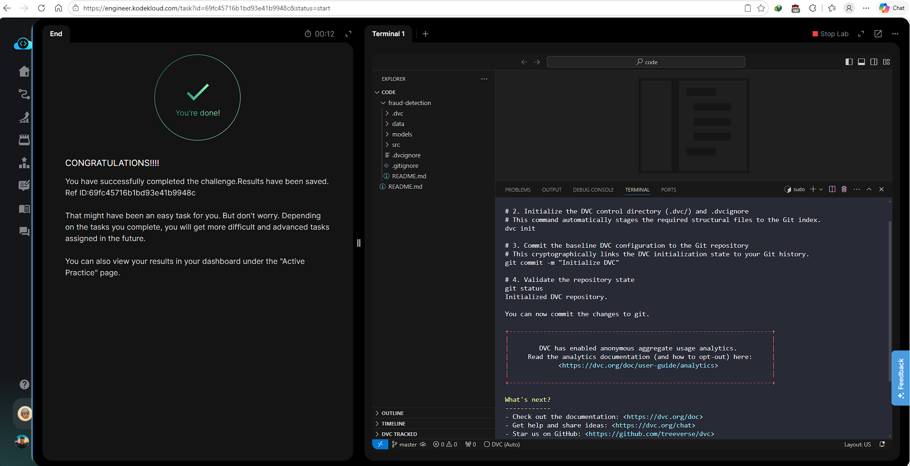

# Day 010 — Install and Initialize DVC in an ML Project

**Date:** 2026-05-21

---

## Problem

The `fraud-detection` Git repository had no DVC setup. The team needed DVC initialized so that datasets and model files can be versioned separately from code, with the initialization recorded in Git history.

---

## Solution

- Ran `dvc init` inside the existing Git repo — creates `.dvc/` control directory and `.dvcignore`
- DVC automatically stages the initialization files to the Git index
- Committed with the required message `Initialize DVC`

---

## Commands

```bash
cd /root/code/fraud-detection/

dvc init

git commit -m "Initialize DVC"

git status
```

---

## Screenshot



---

## Notes

`dvc init` must be run inside an existing Git repo — DVC is not a standalone VCS, it rides on top of Git. The `.dvc/` directory stores DVC's internal config and cache pointers. `.dvcignore` works like `.gitignore` but for DVC — it tells DVC which files to skip when scanning the workspace.
