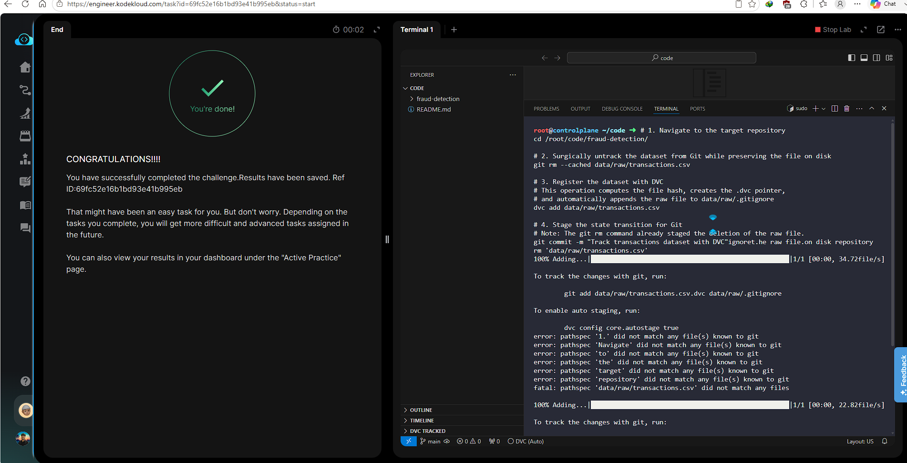

# Day 011 — Track a Dataset with DVC

**Date:** 2026-05-22

---

## Problem

The `transactions.csv` dataset in `data/raw/` was committed directly to Git instead of being tracked by DVC. The team standard requires all datasets under `data/` to be DVC-managed, not Git-tracked.

---

## Solution

- Removed the file from Git tracking without deleting it from disk using `git rm --cached`
- Registered it with DVC — produces a `.dvc` pointer file and auto-updates `data/raw/.gitignore`
- Staged the pointer and gitignore, committed with the required message

---

## Commands

```bash
cd /root/code/fraud-detection/

git rm --cached data/raw/transactions.csv

dvc add data/raw/transactions.csv

git add data/raw/transactions.csv.dvc data/raw/.gitignore

git commit -m "Track transactions dataset with DVC"
```

---

## Screenshot



---

## Notes

`git rm --cached` removes a file from Git's index without touching the actual file on disk — essential when migrating from Git to DVC tracking. `dvc add` then takes ownership: it hashes the file, writes a `.dvc` pointer, and adds the original path to `.gitignore` so Git never accidentally re-tracks it.
