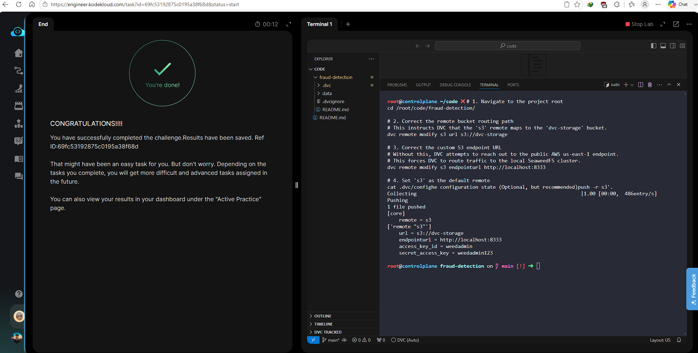

# Day 012 — Configure a DVC Remote Storage

**Date:** 2026-05-23

---

## Problem

The `fraud-detection` project had a broken DVC remote config — `dvc push` failed. The `.dvc/config` had incorrect bucket URL and endpoint, and the remote was not set as default. The team uses SeaweedFS (S3-compatible) as the shared object store.

Setup:
- S3 endpoint: `http://localhost:8333`
- Bucket: `dvc-storage`
- Credentials: `weedadmin / weedadmin123`
- Remote name: `s3`

---

## Solution

- Corrected the remote URL to `s3://dvc-storage`
- Set the correct SeaweedFS endpoint (`http://localhost:8333`) so DVC doesn't route to AWS
- Marked `s3` as the default remote
- Ran `dvc push` — objects appeared under `files/md5/...` in the SeaweedFS Filer UI

---

## Commands

```bash
cd /root/code/fraud-detection/

dvc remote modify s3 url s3://dvc-storage
dvc remote modify s3 endpointurl http://localhost:8333
dvc remote default s3

dvc push

cat .dvc/config
```

---

## Screenshot



---

## Notes

Without `endpointurl`, DVC tries to reach AWS S3 in us-east-1 and fails on any air-gapped or local setup. SeaweedFS exposes an S3-compatible API so DVC needs no special driver — just the correct endpoint. The `files/md5/...` prefix in the bucket is DVC's content-addressable storage layout, identical to how it stores data locally in `.dvc/cache/`.
