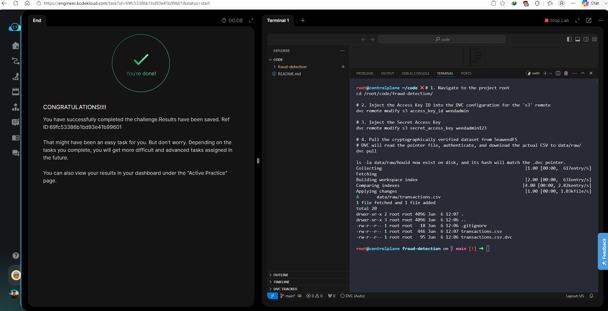

# Day 013 — Pull DVC-Tracked Data from Remote

**Date:** 2026-05-24

---

## Problem

A fresh clone of `fraud-detection` had the `.dvc` pointer file but the actual dataset was missing from disk and local cache. `dvc pull` was failing due to missing credentials in `.dvc/config` — the remote had no `access_key_id` or `secret_access_key` set for the SeaweedFS S3 endpoint.

---

## Solution

- Injected the correct credentials into the DVC `s3` remote config
- Ran `dvc pull` — DVC read the pointer, authenticated against SeaweedFS, and restored `data/raw/transactions.csv`
- Verified the file hash matched the `.dvc` pointer

---

## Commands

```bash
cd /root/code/fraud-detection/

dvc remote modify s3 access_key_id weedadmin
dvc remote modify s3 secret_access_key weedadmin123

dvc pull

ls -la data/raw/
```

---

## Screenshot



---

## Notes

DVC stores credentials in `.dvc/config.local` (not `.dvc/config`) when using `dvc remote modify --local` — the `.local` file is gitignored so secrets never hit the repo. Here the credentials were injected into the shared config for lab purposes. In production, always use `--local` or environment variables (`AWS_ACCESS_KEY_ID`, `AWS_SECRET_ACCESS_KEY`) to keep secrets out of version control.
