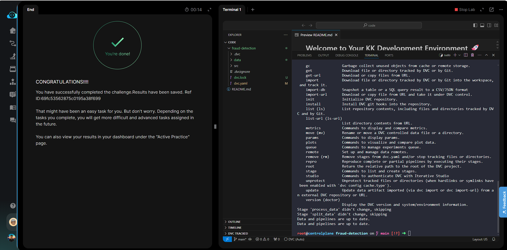

# Day 014 — Create a DVC Pipeline for Data Processing

**Date:** 2026-05-25

---

## Problem

A broken `dvc.yaml` in `fraud-detection` prevented `dvc repro` from completing. The pipeline needed two stages with correct deps and outs wired so DVC could resolve the execution order automatically.

Required stages:
- `process_data` — depends on `transactions.csv` + `process_data.py`, produces `clean_transactions.csv`
- `split_data` — depends on `clean_transactions.csv` + `split_data.py`, produces `train.csv` and `test.csv`

---

## Solution

- Overwrote `dvc.yaml` with the correct two-stage DAG
- Ran `dvc repro` — DVC resolved the dependency graph and executed both stages in order
- Confirmed with `dvc status` — no stale stages

---

## Commands

```bash
cd /root/code/fraud-detection/

cat << 'EOF' > dvc.yaml
stages:
  process_data:
    cmd: python src/data/process_data.py
    deps:
      - data/raw/transactions.csv
      - src/data/process_data.py
    outs:
      - data/processed/clean_transactions.csv
  split_data:
    cmd: python src/data/split_data.py
    deps:
      - data/processed/clean_transactions.csv
      - src/data/split_data.py
    outs:
      - data/processed/train.csv
      - data/processed/test.csv
EOF

dvc repro

dvc status
```

---

## Screenshot



---

## Notes

DVC infers stage execution order from the `deps`/`outs` graph — `split_data` depends on `clean_transactions.csv` which is an output of `process_data`, so DVC always runs them in the correct order without explicit ordering. `dvc repro` is idempotent: it skips stages whose inputs haven't changed, making pipelines efficient to re-run.
