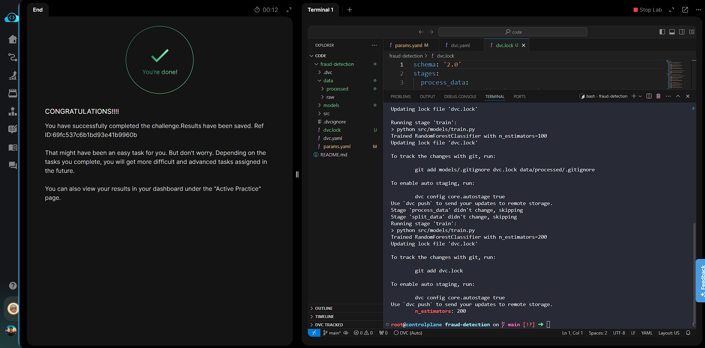

# Day 015 — Parameterize a DVC Pipeline

**Date:** 2026-05-26

---

## Problem

The `train` stage in `dvc.yaml` referenced `n_estimators` from `params.yaml`, but `dvc repro` failed because the key name in `params.yaml` didn't match — a typo (`n_estimator` or similar). Every key listed under `params:` in `dvc.yaml` must resolve exactly to a key in `params.yaml`.

---

## Solution

- Fixed the key name in `params.yaml` using `sed` — ensured `n_estimators` exists with the correct spelling
- Ran `dvc repro` — full pipeline executed cleanly
- Updated `n_estimators` to `200` and re-ran `dvc repro` — only the `train` stage re-executed (upstream stages skipped as their inputs were unchanged)
- Confirmed the new value was recorded in `dvc.lock`

---

## Commands

```bash
cd /root/code/fraud-detection/

# Fix the key name typo in params.yaml
sed -i 's/n_estimator[s]*[ ]*:/n_estimators:/g' params.yaml

# Ensure the key exists if file was empty/broken
grep -q "n_estimators" params.yaml || echo "n_estimators: 100" >> params.yaml

# Run the full pipeline
dvc repro

# Change the parameter value
sed -i 's/n_estimators: .*/n_estimators: 200/g' params.yaml

# Re-run — only train stage should execute
dvc repro

# Verify new value is locked
cat dvc.lock | grep "n_estimators"
```

---

## Screenshot



---

## Notes

DVC tracks parameters by their hash — changing `n_estimators` invalidates only the `train` stage cache, not `process_data` or `split_data`. This is the core value of parameterized pipelines: partial re-execution instead of full reruns. The new value gets cryptographically recorded in `dvc.lock`, making every experiment reproducible by git checkout + `dvc repro`.
