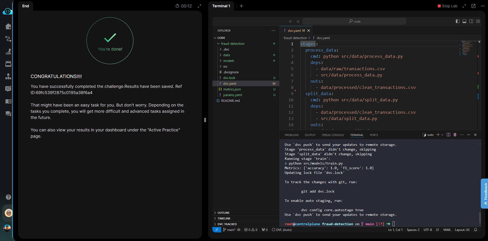

# Day 016 — Track ML Metrics with DVC

**Date:** 2026-05-27

---

## Problem

The `train` stage wrote `metrics.json` but DVC did not recognise it as a metric — it was listed under `outs:` as a regular file output. `dvc metrics show` returned nothing. The fix required moving `metrics.json` from `outs:` to a `metrics:` block with `cache: false`.

---

## Solution

- Rewrote `dvc.yaml` to declare `metrics.json` under `metrics:` with `cache: false`
- `cache: false` keeps the JSON in Git (for diff history) instead of the DVC cache
- Re-ran `dvc repro` to apply the structural change
- Validated with `dvc metrics show` — `accuracy` and `f1_score` surfaced correctly

---

## Commands

```bash
cd /root/code/fraud-detection/

cat << 'EOF' > dvc.yaml
stages:
  process_data:
    cmd: python src/data/process_data.py
    deps:
      - data/raw/transactions.csv
      - src/data/process_data.py
    outs:
      - data/processed/clean_transactions.csv
  split_data:
    cmd: python src/data/split_data.py
    deps:
      - data/processed/clean_transactions.csv
      - src/data/split_data.py
    outs:
      - data/processed/train.csv
      - data/processed/test.csv
  train:
    cmd: python src/models/train.py
    deps:
      - data/processed/train.csv
      - src/models/train.py
    params:
      - n_estimators
    outs:
      - models/model.pkl
    metrics:
      - metrics.json:
          cache: false
EOF

dvc repro

dvc metrics show
```

---

## Screenshot



---

## Notes

`cache: false` on a metric means the file is tracked by Git directly, not stored in the DVC cache. This enables `dvc metrics diff` across Git commits — you can compare accuracy between any two commits without pulling data from remote storage. Metrics in `outs:` are invisible to `dvc metrics show`; they must be in the `metrics:` block.
