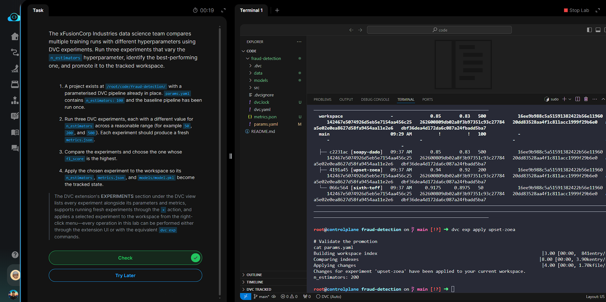

# Day 017 — Run and Compare DVC Experiments

**Date:** 2026-05-28

---

## Problem

The team needed to compare multiple training runs with different `n_estimators` values using DVC experiments, identify the best `f1_score`, and promote the winning experiment to the tracked workspace.

---

## Solution

- Ran three isolated experiments with `n_estimators` set to 50, 200, and 500 using `--set-param` (no permanent edits to `params.yaml`)
- Compared all runs with `dvc exp show` — read the `f1_score` column to find the winner
- Applied the winning experiment with `dvc exp apply <experiment-name>`
- Verified `params.yaml` was updated to the winning `n_estimators` value

---

## Commands

```bash
cd /root/code/fraud-detection/

# Run three experiments with different hyperparameter values
dvc exp run --set-param n_estimators=50
dvc exp run --set-param n_estimators=200
dvc exp run --set-param n_estimators=500

# Compare all experiments — find highest f1_score in the output table
dvc exp show

# Apply the winning experiment (replace with actual name from dvc exp show output)
dvc exp apply <WINNING_EXP_NAME>

# Verify params.yaml reflects the winning value
cat params.yaml
```

---

## Screenshot



---

## Notes

`dvc exp run --set-param` overrides `params.yaml` temporarily for that run only — the workspace `params.yaml` stays unchanged until `dvc exp apply`. Each experiment gets a random name (e.g. `exp-a1b2c`) visible in the `dvc exp show` table. `dvc exp apply` promotes the chosen experiment's params, metrics, and artifacts into the tracked workspace in one atomic operation.
