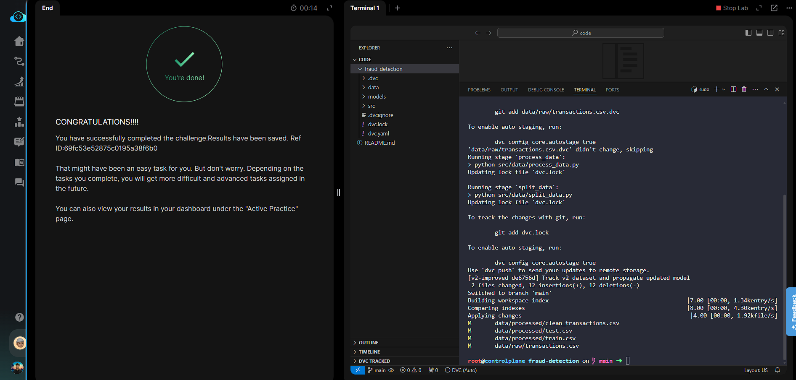

# Day 018 — Version Datasets and Models Across Git Branches

**Date:** 2026-05-29

---

## Problem

The team needed to maintain different dataset and model versions on separate Git branches so that switching branches restores the correct data on disk. The goal: tag the current state as `v1.0`, produce a `v2-improved` branch with a newer dataset, then prove that switching back to `main` + `dvc checkout` restores the original data.

---

## Solution

- Tagged the current `main` branch state as `v1.0`
- Created `v2-improved` branch, replaced `transactions.csv` with `transactions_v2.csv`, re-tracked with DVC, re-ran the pipeline, and committed the updated pointer
- Switched back to `main` and ran `dvc checkout` — DVC restored the v1 dataset from cache, matching the hash in the `v1.0` tag

---

## Commands

```bash
cd /root/code/fraud-detection/

# Tag the baseline
git tag -a v1.0 -m "v1.0 baseline model and dataset"

# Create and switch to v2 branch
git checkout -b v2-improved

# Replace the dataset
cp data/raw/transactions_v2.csv data/raw/transactions.csv

# Re-track with DVC and re-run pipeline
dvc add data/raw/transactions.csv
dvc repro

# Commit the updated pointers
git add data/raw/transactions.csv.dvc dvc.lock
git commit -m "Track v2 dataset and propagate updated model"

# Switch back to main and restore v1 data
git checkout main
dvc checkout
```

---

## Screenshot



---

## Notes

`dvc checkout` is the key command here — Git `checkout` switches the `.dvc` pointer files, but the actual data on disk is still whatever was there last. `dvc checkout` reads the active pointer and syncs the filesystem to match. This is the mechanism that makes branch-based dataset versioning work in practice.
