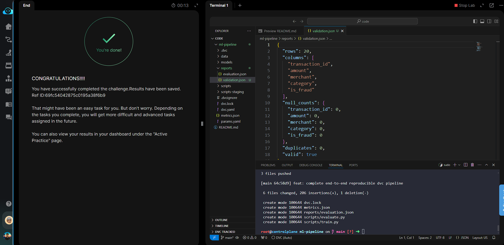

# Day 019 — Build Complete DVC ML Pipeline with Remote Storage and Experiments

**Date:** 2026-05-30

---

## Problem

A partially wired DVC pipeline at `/root/code/ml-pipeline/` had three stages but two were missing and one had a broken output path (`cleaned.csv` instead of `clean.csv`). The goal was to fix the data contract, add the `train` and `evaluate` stages, run the full pipeline, push artifacts to SeaweedFS, and tag a `v1.0` release.

---

## Solution

- Identified the broken output path by running `dvc repro` and checking `ls data/processed/` — script produced `clean.csv`, not `cleaned.csv`
- Fixed the `preprocess` stage `outs` in `dvc.yaml`
- Copied `train.py` and `evaluate.py` from `scripts-staging/` into `scripts/`
- Added `train` and `evaluate` stages to `dvc.yaml` with correct deps, params, outs, and metrics
- Ran `dvc repro` end-to-end, pushed artifacts with `dvc push`, and committed + tagged `v1.0`

---

## Commands

```bash
cd /root/code/ml-pipeline/

# Step 1 — Fix broken output path in dvc.yaml (cleaned.csv → clean.csv)
# Edit dvc.yaml preprocess stage outs

# Step 2 — Stage the execution scripts
cp scripts-staging/train.py scripts/train.py
cp scripts-staging/evaluate.py scripts/evaluate.py

# Step 3 — Add train and evaluate stages to dvc.yaml
# (append to existing dvc.yaml)
cat << 'EOF' >> dvc.yaml
  train:
    cmd: python scripts/train.py
    deps:
      - data/processed/clean.csv
      - scripts/train.py
    params:
      - n_estimators
      - max_depth
      - test_size
      - random_seed
    outs:
      - models/model.pkl
      - data/processed/test_split.csv
    metrics:
      - metrics.json:
          cache: false
  evaluate:
    cmd: python scripts/evaluate.py
    deps:
      - models/model.pkl
      - data/processed/test_split.csv
      - scripts/evaluate.py
    outs:
      - reports/evaluation.json:
          cache: false
EOF

# Step 4 — Run the full pipeline and push to remote
dvc repro
dvc push

# Step 5 — Commit and tag v1.0
git add dvc.yaml dvc.lock scripts/train.py scripts/evaluate.py metrics.json reports/evaluation.json
git commit -m "feat: complete end-to-end reproducible dvc pipeline"
git tag -a v1.0 -m "Release production baseline v1.0"
```

---

## Screenshot



---

## Notes

The broken `outs` path (`cleaned.csv` vs `clean.csv`) is a classic data contract mismatch — DVC looks for what `dvc.yaml` declares, not what the script actually writes. Always verify with `ls` before assuming the script is wrong. `cache: false` on metrics and reports keeps them in Git so CI/CD can read them without pulling from S3. `git checkout v1.0 && dvc checkout` is the full time-travel command to restore any tagged state.
