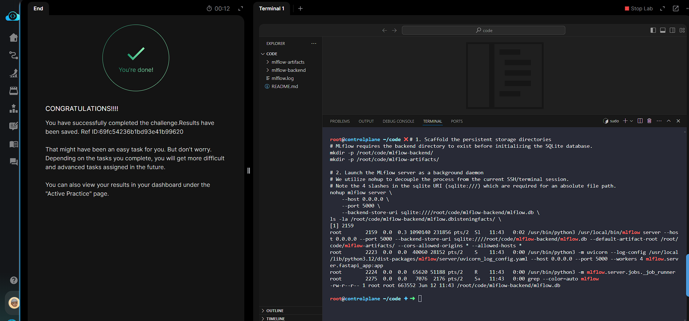

# Day 020 — Install and Start the MLflow Tracking Server

**Date:** 2026-05-31

---

## Problem

The team needed a persistent MLflow tracking server running on the workstation so experiments can be logged centrally. Requirements: listening on all interfaces at port 5000, SQLite backend at a specific path, artifact root configured, and proxy-compatible headers accepted.

---

## Solution

- Created the backend and artifact directories before starting the server (MLflow aborts if they're missing)
- Launched the server with `nohup` to decouple it from the terminal session
- Passed `--cors-allowed-origins '*'` and `--allowed-hosts '*'` so the lab proxy can reach it
- Validated with `ps aux` and confirmed `mlflow.db` was created on disk

---

## Commands

```bash
mkdir -p /root/code/mlflow-backend/
mkdir -p /root/code/mlflow-artifacts/

nohup mlflow server \
    --host 0.0.0.0 \
    --port 5000 \
    --backend-store-uri sqlite:////root/code/mlflow-backend/mlflow.db \
    --default-artifact-root /root/code/mlflow-artifacts/ \
    --cors-allowed-origins '*' \
    --allowed-hosts '*' \
    > /root/code/mlflow.log 2>&1 &

sleep 3
ps aux | grep mlflow
ls -la /root/code/mlflow-backend/mlflow.db
```

---

## Screenshot



---

## Notes

The SQLite URI requires four slashes (`sqlite:////`) for an absolute path — three from the scheme (`sqlite:///`) plus one for the root `/`. `nohup` with `&` daemonizes the process so it survives terminal closure; logs go to `mlflow.log` for debugging. The `--cors-allowed-origins` and `--allowed-hosts` flags are only needed when the UI is accessed through a proxy.
